##### 安装Git

安装完成后，还需要最后一步设置，在命令行输入：

```tex
$ git config --global user.name "Your Name"
$ git config --global user.email "email@example.com"
```

##### 创建版本库：

什么是版本库呢？版本库又名仓库，英文名**repository**，你可以简单理解成一个目录，这个目录里面的所有文件都可以被Git管理起来，每个文件的修改、删除，Git都能跟踪，以便任何时刻都可以追踪历史，或者在将来某个时刻可以“还原”。

所以，创建一个版本库非常简单，首先，选择一个合适的地方，创建一个空目录：

```tex
$ mkdir learngit
$ cd learngit
$ pwd
/Users/michael/learngit
```

第二步，通过`git init`命令把这个目录变成Git可以管理的仓库：

```tex
$ git init
Initialized empty Git repository in /Users/michael/learngit/.git/
```

当前目录下多了一个`.git`的目录，这个目录是Git来跟踪管理版本库的，没事千万不要手动修改这个目录里面的文件，不然改乱了，就把Git仓库给破坏了。

##### 把文件添加到版本库

所有的版本控制系统，其实只能跟踪文本文件的改动，比如TXT文件，网页，所有的程序代码等等，Git也不例外。版本控制系统可以告诉你每次的改动，比如在第5行加了一个单词“Linux”，在第8行删了一个单词“Windows”。而图片、视频这些二进制文件，虽然也能由版本控制系统管理，但没法跟踪文件的变化，只能把二进制文件每次改动串起来，也就是只知道图片从100KB改成了120KB，但到底改了啥，版本控制系统不知道，也没法知道。

Microsoft的Word格式是二进制格式，因此，版本控制系统是没法跟踪Word文件的改动的，前面我们举的例子只是为了演示，如果要真正使用版本控制系统，就要以纯文本方式编写文件。

因为文本是有编码的，比如中文有常用的GBK编码，日文有Shift_JIS编码，如果没有历史遗留问题，强烈建议使用标准的UTF-8编码，所有语言使用同一种编码，既没有冲突，又被所有平台所支持。

<span style="color:red;">使用Windows的童鞋要特别注意：</span>

千万不要使用Windows自带的**记事本**编辑任何文本文件。原因是Microsoft开发记事本的团队使用了一个非常弱智的行为来保存UTF-8编码的文件，他们自作聪明地在每个文件开头添加了0xefbbbf（十六进制）的字符，你会遇到很多不可思议的问题，比如，网页第一行可能会显示一个“?”，明明正确的程序一编译就报语法错误，等等，都是由记事本的弱智行为带来的。建议你下载[Visual Studio Code](https://code.visualstudio.com/)代替记事本，不但功能强大，而且免费！

现在我们编写一个`readme.txt`文件，内容如下：

```tex
Git is a version control system.
Git is free software.
```

一定要放到`learngit`目录下（子目录也行），因为这是一个Git仓库，放到其他地方Git再厉害也找不到这个文件。

```tex
$ git add readme.txt
```

执行上面的命令，没有任何显示，这就对了，Unix的哲学是“没有消息就是好消息”，说明添加成功。

第二步，用命令`git commit`告诉Git，把文件提交到仓库：

```tex
$ git commit -m "wrote a readme file"
[master (root-commit) eaadf4e] wrote a readme file
 1 file changed, 2 insertions(+)
 create mode 100644 readme.txt
```

简单解释一下`git commit`命令，`-m`后面输入的是本次提交的说明，可以输入任意内容，当然最好是有意义的，这样你就能从历史记录里方便地找到改动记录。

`git commit`命令执行成功后会告诉你，`1 file changed`：1个文件被改动（我们新添加的readme.txt文件）；`2 insertions`：插入了两行内容（readme.txt有两行内容）。

为什么Git添加文件需要`add`，`commit`一共两步呢？因为`commit`可以一次提交很多文件，所以你可以多次`add`不同的文件，比如：

```tex
$ git add file1.txt
$ git add file2.txt file3.txt
$ git commit -m "add 3 files."
```

#### 时光机穿梭

我们已经成功地添加并提交了一个readme.txt文件，现在，是时候继续工作了，于是，我们继续修改readme.txt文件，改成如下内容：

```te
Git is a distributed version control system.
Git is free software.
```

现在，运行`git status`命令看看结果：

```tex
$ git status
On branch master
Changes not staged for commit:
  (use "git add <file>..." to update what will be committed)
  (use "git checkout -- <file>..." to discard changes in working directory)

	modified:   readme.txt

no changes added to commit (use "git add" and/or "git commit -a")
```

`git status`命令可以让我们时刻掌握仓库当前的状态，上面的命令输出告诉我们，`readme.txt`被修改过了，但还没有准备提交的修改。

虽然Git告诉我们`readme.txt`被修改了，但如果能看看具体修改了什么内容，自然是很好的。比如你休假两周从国外回来，第一天上班时，已经记不清上次怎么修改的`readme.txt`，所以，需要用`git diff`这个命令看看：

```tex
$ git diff readme.txt 
diff --git a/readme.txt b/readme.txt
index 46d49bf..9247db6 100644
--- a/readme.txt
+++ b/readme.txt
@@ -1,2 +1,2 @@
-Git is a version control system.
+Git is a distributed version control system.
 Git is free software.
```

<span style="color:red">如果`git diff` 不起作用也可以使用git自带的gitk查看。</span>

提交修改和提交新文件是一样的两步，第一步是`git add`：

在执行第二步`git commit`之前，我们再运行`git status`看看当前仓库的状态：

```t
$ git status
On branch master
Changes to be committed:
  (use "git reset HEAD <file>..." to unstage)

	modified:   readme.txt
```

`git status`告诉我们，将要被提交的修改包括`readme.txt`，下一步，就可以放心地提交了

```tex
$ git commit -m "add distributed"
[master e475afc] add distributed
 1 file changed, 1 insertion(+), 1 deletion(-)
```

提交后，我们再用`git status`命令看看仓库的当前状态：

```tex
$ git status
On branch master
nothing to commit, working tree clean
```

##### 版本回退

用`git log`命令查看历史提交记录：

```tex
$ git log
commit 952ab471a278d7da671353ae1f68e8582bd38a90 (HEAD -> master)
Author: tg793708435 <793708435@qq.com>
Date:   Tue May 28 13:38:08 2024 +0800

    append GPL

commit 5d75afb852e77b020b70afb89e84bdfb427ff2af
Author: tg793708435 <793708435@qq.com>
Date:   Tue May 28 13:18:04 2024 +0800

    add distributed

commit 18cb1855009454839c1eef79e4e5d786f25e7be1
Author: tg793708435 <793708435@qq.com>
Date:   Tue May 28 13:07:20 2024 +0800

    wrote a readme file
```

如果嫌输出信息太多，看得眼花缭乱的，可以试试加上`--pretty=oneline`参数：

```tex
$ git log --pretty=oneline
952ab471a278d7da671353ae1f68e8582bd38a90 (HEAD -> master) append GPL
5d75afb852e77b020b70afb89e84bdfb427ff2af add distributed
18cb1855009454839c1eef79e4e5d786f25e7be1 wrote a readme file
```

Git的`commit id`不是1，2，3……递增的数字，而是一个SHA1计算出来的一个非常大的数字，用十六进制表示。

Git必须知道当前版本是哪个版本，在Git中，用`HEAD`表示当前版本，上一个版本就是`HEAD^`，上上一个版本就是`HEAD^^`，当然往上100个版本写100个`^`比较容易数不过来，所以写成`HEAD~100`。

可以使用`git reset`命令回退到上一个版本

```tex
$ git reset --hard HEAD~1
HEAD is now at 5d75afb add distributed

$ git log --pretty=oneline
5d75afb852e77b020b70afb89e84bdfb427ff2af (HEAD -> master) add distributed
18cb1855009454839c1eef79e4e5d786f25e7be1 wrote a readme file
```

此时已经看不到最新的那个版本信息了。

想要再回到最新的版本，只要上面的命令行窗口还没有被关掉，你就可以顺着往上找啊找啊，找到那个`append GPL`的`commit id`是`952a...`，于是就可以指定回到未来的某个版本：

```tex
$ git reset --hard 952a
HEAD is now at 952ab47 append GPL
```

Git提供了一个命令`git reflog`用来记录你的每一次命令：

```tex
$ git reflog
952ab47 (HEAD -> master) HEAD@{0}: reset: moving to 952a
5d75afb HEAD@{1}: reset: moving to HEAD^
952ab47 (HEAD -> master) HEAD@{2}: reset: moving to 952a
5d75afb HEAD@{3}: reset: moving to HEAD~1
952ab47 (HEAD -> master) HEAD@{4}: reset: moving to 952a
5d75afb HEAD@{5}: reset: moving to HEAD^
952ab47 (HEAD -> master) HEAD@{6}: reset: moving to HEAD
952ab47 (HEAD -> master) HEAD@{7}: commit: append GPL
5d75afb HEAD@{8}: commit: add distributed
18cb185 HEAD@{9}: commit (initial): wrote a readme file
```

可以通过这个命令找到最新的分支的sha1的开头几位的值，再恢复到那条分支。

##### 工作区和暂存区

###### 工作区（Working Directory）

就是你在电脑里能看到的目录，比如我的`git_learn`文件夹就是一个工作区：

###### 版本库（Repository）

工作区有一个隐藏目录`.git`，这个不算工作区，而是Git的版本库。

Git的版本库里存了很多东西，其中最重要的就是称为stage（或者叫index）的暂存区，还有Git为我们自动创建的第一个分支`master`，以及指向`master`的一个指针叫`HEAD`。

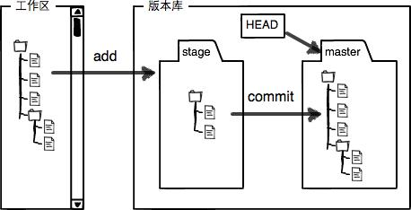

前面讲了我们把文件往Git版本库里添加的时候，是分两步执行的：

第一步是用`git add`把文件添加进去，实际上就是把文件修改添加到暂存区；

第二步是用`git commit`提交更改，实际上就是把暂存区的所有内容提交到当前分支。

因为我们创建Git版本库时，Git自动为我们创建了唯一一个`master`分支，所以，现在，`git commit`就是往`master`分支上提交更改。

你可以简单理解为，需要提交的文件修改通通放到暂存区，然后，一次性提交暂存区的所有修改。

对`readme.txt`做个修改，在工作区新增一个`LICENSE`文本文件

先用`git status`查看一下状态：

```tex
$ git status
On branch master
Changes not staged for commit:
  (use "git add <file>..." to update what will be committed)
  (use "git restore <file>..." to discard changes in working directory)
        modified:   readme.txt

Untracked files:
  (use "git add <file>..." to include in what will be committed)
        LICENSE.txt

no changes added to commit (use "git add" and/or "git commit -a")
```

Git非常清楚地告诉我们，`readme.txt`被修改了，而`LICENSE`还从来没有被添加过，所以它的状态是`Untracked`。

现在，使用两次命令`git add`，把`readme.txt`和`LICENSE`都添加后，用`git status`再查看一下：

```tex
$ git status
On branch master
Changes to be committed:
  (use "git restore --staged <file>..." to unstage)
        new file:   LICENSE.txt
        modified:   readme.txt
```

现在，暂存区的状态就变成这样了：

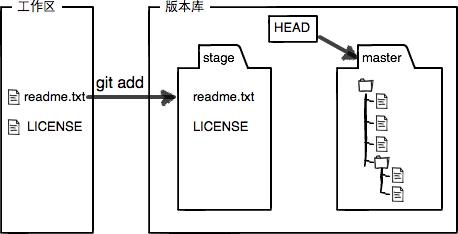

所以，`git add`命令实际上就是把要提交的所有修改放到暂存区（Stage），然后，执行`git commit`就可以一次性把暂存区的所有修改提交到分支。

```tex
$ git commit -m "understand how stage works"
[master a0c1f02] understand how stage works
 2 files changed, 2 insertions(+)
 create mode 100644 LICENSE.txt
```

一旦提交后，如果你又没有对工作区做任何修改，那么工作区就是“干净”的：

```tex
$ git status
On branch master
nothing to commit, working tree clean
```

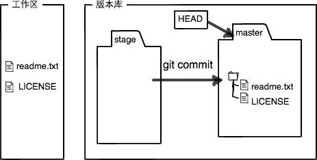

##### 管理修改

git管理的是修改

第一次修改文件后，执行`git add`后，又修改文件，再次执行`git commit`，这个commit只会对第一次的修改进行提交。因为commit只会提交保存在暂存区的文件，即add之后的文件。第二次修改只是修改工作区的文件，不会对commit产生影响。

```tex
// 第一次修改文件
$ git status
On branch master
Changes not staged for commit:
  (use "git add <file>..." to update what will be committed)
  (use "git restore <file>..." to discard changes in working directory)
        modified:   readme.txt

no changes added to commit (use "git add" and/or "git commit -a")


// 查看状态
$ git add readme.txt

// 添加到暂存区
C:\Users\tang\Desktop\git_learn (master)
$ git status
On branch master
Changes to be committed:
  (use "git restore --staged <file>..." to unstage)
        modified:   readme.txt

// 第二次修改文件
$ git status
On branch master
Changes to be committed:
  (use "git restore --staged <file>..." to unstage)
        modified:   readme.txt

Changes not staged for commit:
  (use "git add <file>..." to update what will be committed)
  (use "git restore <file>..." to discard changes in working directory)
  
// 执行提交，只能提交暂存区的文件，即第一次的修改
$ git commit -m "git tracks changes"
[master 777311f] git tracks changes
 1 file changed, 2 insertions(+), 1 deletion(-)
 
 
// 查看状态，看到还有文件已被修改，即第二次的修改
$ git status
On branch master
Changes not staged for commit:
  (use "git add <file>..." to update what will be committed)
  (use "git restore <file>..." to discard changes in working directory)
        modified:   readme.txt

no changes added to commit (use "git add" and/or "git commit -a")

// 查看工作区和版本库最新版本的区别
$ git diff HEAD -- readme.txt
diff --git a/readme.txt b/readme.txt
index db28b2c..9a8b341 100644
--- a/readme.txt
+++ b/readme.txt
@@ -1,4 +1,4 @@
 Git is a distributed version control system.
 Git is free software distributed under the GPL.
 Git has a mutable index called stage.
-Git tracks changes.
\ No newline at end of file
+Git tracks changes of files.
\ No newline at end of file
```

##### 撤销修改

- 如果消息没有提交到暂存区，即没有执行`git add` 命令，想要撤销修改，可以执行`git restore`命令修改掉之前的内容。

```tex
// 修改，但未提交到暂存区
$ git status
On branch master
Changes not staged for commit:
  (use "git add <file>..." to update what will be committed)
  (use "git restore <file>..." to discard changes in working directory)
        modified:   readme.txt

no changes added to commit (use "git add" and/or "git commit -a")
// 撤销修改
C:\Users\tang\Desktop\git_learn (master)
$ git restore readme.txt

C:\Users\tang\Desktop\git_learn (master)
$ git status
On branch master
nothing to commit, working tree clean
```

- 如果修改的文件已经提交到了暂存区，则需要通过`git restore --staged` 将暂存区的文件撤销到跟版本库最新的内容相同，再执行`git restore` 将工作区的文件信息撤销。

```tex
// 修改
$ git status                                                           
On branch master                                                       
Changes not staged for commit:                                         
  (use "git add <file>..." to update what will be committed)           
  (use "git restore <file>..." to discard changes in working directory)
        modified:   readme.txt                                         
                                                                       
no changes added to commit (use "git add" and/or "git commit -a")      
// 添加到暂存区                                                                       
C:\Users\tang\Desktop\git_learn (master)                               
$ git add readme.txt                                                   
                                                                       
C:\Users\tang\Desktop\git_learn (master)                               
$ git status                                                           
On branch master                                                       
Changes to be committed:                                               
  (use "git restore --staged <file>..." to unstage)                    
        modified:   readme.txt                                         
 // 撤销，将暂存区的内容撤销掉，回到工作区                                                       
 $ git restore --staged  readme.txt

C:\Users\tang\Desktop\git_learn (master)
$ git status
On branch master
Changes not staged for commit:
  (use "git add <file>..." to update what will be committed)
  (use "git restore <file>..." to discard changes in working directory)
        modified:   readme.txt

no changes added to commit (use "git add" and/or "git commit -a")   

// 撤销工作区的内容
C:\Users\tang\Desktop\git_learn (master)
$ git restore readme.txt

C:\Users\tang\Desktop\git_learn (master)
$ git status
On branch master
nothing to commit, working tree clean
```

- 如果内容已经被提交到版本区了，想要撤销修改是有条件的，就是你还没有把自己的本地版本库推送到远程。就可以通过版本回退，`git reset --hard HEAD~1`退回到上一个版本。

##### 删除文件

工作区中有一个文件，如果没有被提交到暂存区，删除了就没有了，因为没有托管给git，如果存入到了暂存区，即被git托管之后，工作区删除了该文件：

- 该文件误删
- - 可以通过`git restore --staged` 将该文件撤回工作区，
  - <span style="color:red">从工作区中恢复的文件只是上次提交的版本，本次删除前修改的信息已经丢失</span>
- 该文件不是误删，需要删除
- - 通过`git rm` 方法删除暂存区的文件

```tex
// 工作区中添加一个文件
$ git status
On branch master
Untracked files:
  (use "git add <file>..." to include in what will be committed)
        test.js

nothing added to commit but untracked files present (use "git add" to track)

// 直接删除
$ rm test.js

C:\Users\tang\Desktop\git_learn (master)
$ git status
On branch master
nothing to commit, working tree clean
```

```tex
// 工作区中添加一个文件
$ git status
On branch master
Untracked files:
  (use "git add <file>..." to include in what will be committed)
        test.js

nothing added to commit but untracked files present (use "git add" to track)
// 添加到暂存区
$ git add test.js

C:\Users\tang\Desktop\git_learn (master)
$ git status
On branch master
Changes to be committed:
  (use "git restore --staged <file>..." to unstage)
        new file:   test.js
// 工作区删除文件        
$ rm test.js

C:\Users\tang\Desktop\git_learn (master)
$ git status
On branch master
Changes to be committed:
  (use "git restore --staged <file>..." to unstage)
        new file:   test.js

Changes not staged for commit:
  (use "git add/rm <file>..." to update what will be committed)
  (use "git restore <file>..." to discard changes in working directory)
        deleted:    test.js
// 从暂存区恢复
$ git restore test.js

C:\Users\tang\Desktop\git_learn (master)
$ git status
On branch master
Changes to be committed:
  (use "git restore --staged <file>..." to unstage)
        new file:   test.js
        
// 工作区删除文件  
$ rm test.js

C:\Users\tang\Desktop\git_learn (master)
$ git status
On branch master
Changes to be committed:
  (use "git restore --staged <file>..." to unstage)
        new file:   test.js

Changes not staged for commit:
  (use "git add/rm <file>..." to update what will be committed)
  (use "git restore <file>..." to discard changes in working directory)
        deleted:    test.js
// 删除暂存区的文件
$ git rm test.js
rm 'test.js'

C:\Users\tang\Desktop\git_learn (master)
$ git status
On branch master
nothing to commit, working tree clean
```

#### 远程仓库

- 第1步：创建SSH Key。在用户主目录下，看看有没有.ssh目录，如果有，再看看这个目录下有没有`id_rsa`和`id_rsa.pub`这两个文件，如果已经有了，可直接跳到下一步。如果没有，打开Shell（Windows下打开Git Bash），创建SSH Key：

```tex
$ ssh-keygen -t rsa -C "youremail@example.com"
```

在用户主目录里找到`.ssh`目录，里面有`id_rsa`和`id_rsa.pub`两个文件，这两个就是SSH Key的秘钥对，`id_rsa`是私钥，不能泄露出去，`id_rsa.pub`是公钥，可以放心地告诉任何人。

- 第2步：登陆GitHub，打开“Account settings”，“SSH Keys”页面，然后，点“Add SSH Key”，填上任意Title，在Key文本框里粘贴`id_rsa.pub`文件的内容：

##### 添加远程库

创建好仓库，使用`$ git remote add origin git@github.com:michaelliao/learngit.git` 在本地添加远程仓库。

通过`git push -u origin master`将本地库的所有内容推送到远程库上。

由于远程库是空的，我们第一次推送`master`分支时，加上了`-u`参数，Git不但会把本地的`master`分支内容推送的远程新的`master`分支，还会把本地的`master`分支和远程的`master`分支关联起来，在以后的推送或者拉取时就可以简化命令。

##### 删除远程库

如果添加的时候地址写错了，或者就是想删除远程库，可以用`git remote rm <name>`命令。使用前，建议先用`git remote -v`查看远程库信息：

```tex
PS D:\android_Code\MyDemos\MyWanAndroid> git remote -v
origin  git@github.com:tg793708435/WanAndroid.git (fetch)
origin  git@github.com:tg793708435/WanAndroid.git (push)
```

然后，根据名字删除，比如删除`origin`：`git remote rm origin`

**此处的“删除”其实是解除了本地和远程的绑定关系，并不是物理上删除了远程库。远程库本身并没有任何改动。要真正删除远程库，需要登录到GitHub，在后台页面找到删除按钮再删除。**

##### 从远程库克隆

`git clone git@github.com:michaelliao/gitskills.git`

#### 分支管理

##### 创建与合并分支

截止到目前，只有一条时间线，在Git里，这个分支叫主分支，即`master`分支。`HEAD`严格来说不是指向提交，而是指向`master`，`master`才是指向提交的，所以，`HEAD`指向的就是当前分支。

一开始的时候，`master`分支是一条线，Git用`master`指向最新的提交，再用`HEAD`指向`master`，就能确定当前分支，以及当前分支的提交点：

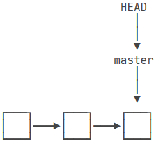

每次提交，`master`分支都会向前移动一步，这样，随着你不断提交，`master`分支的线也越来越长。

当我们创建新的分支，例如`dev`时，Git新建了一个指针叫`dev`，指向`master`相同的提交，再把`HEAD`指向`dev`，就表示当前分支在`dev`上：

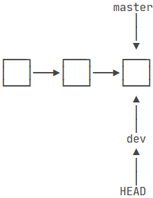

从现在开始，对工作区的修改和提交就是针对`dev`分支了，比如新提交一次后，`dev`指针往前移动一步，而`master`指针不变：

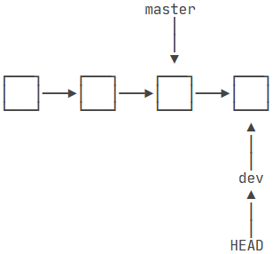

假如我们在`dev`上的工作完成了，就可以把`dev`合并到`master`上。Git怎么合并呢？最简单的方法，就是直接把`master`指向`dev`的当前提交，就完成了合并：

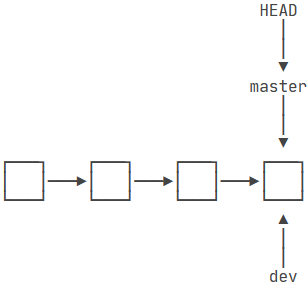

合并完分支后，甚至可以删除`dev`分支。删除`dev`分支就是把`dev`指针给删掉，删掉后，我们就剩下了一条`master`分支：

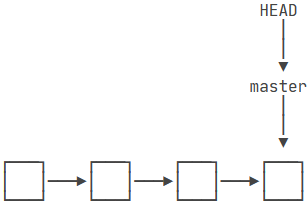

Git创建一个分支和合并分支都很快，只是对指针的操作，创建dev指针，修改master指针。

###### 具体步骤

首先，我们创建`dev`分支，然后切换到`dev`分支：`git switch -c dev`

```tex
$ git branch
* master

// 创建dev分支
C:\Users\tang\Desktop\git_learn (master)
$ git switch -c dev
Switched to a new branch 'dev'
```

`git switch`命令加上`-bc参数表示创建并切换，相当于以下两条命令：

```tex
$ git branch dev
$ git switch dev
Switched to branch 'dev'
```

然后，用`git branch`命令查看当前分支：

```tex
$ git branch
* dev
  master
```

`git branch`命令会列出所有分支，当前分支前面会标一个`*`号。

然后，我们就可以在`dev`分支上正常提交，做出修改并提交

```tex
C:\Users\tang\Desktop\git_learn (dev)
$ git status
On branch dev
Changes not staged for commit:
  (use "git add <file>..." to update what will be committed)
  (use "git restore <file>..." to discard changes in working directory)
        modified:   readme.txt

no changes added to commit (use "git add" and/or "git commit -a")
// 提交到暂存区
C:\Users\tang\Desktop\git_learn (dev)
$ git add readme.txt

// 提交到工作区
C:\Users\tang\Desktop\git_learn (dev)
$ git commit -m "branch-test"
[dev c359151] branch-test
 1 file changed, 5 insertions(+), 4 deletions(-)

C:\Users\tang\Desktop\git_learn (dev)
$ git status
On branch dev
nothing to commit, working tree clean
```

现在，`dev`分支的工作完成，我们就可以切换回`master`分支：`git switch master`

```tex
$ git switch master
Switched to branch 'master'
```

切换回`master`分支后，再查看一个`readme.txt`文件，刚才添加的内容不见了！因为那个提交是在`dev`分支上，而`master`分支此刻的提交点并没有变：

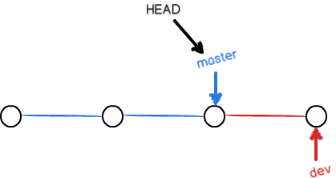

现在，我们把`dev`分支的工作成果合并到`master`分支上：`git merge dev`

```tex
$ git merge dev
Updating 777311f..c359151
Fast-forward
 readme.txt | 9 +++++----
 1 file changed, 5 insertions(+), 4 deletions(-)
```

`git merge`命令用于合并指定分支到当前分支。合并后，再查看`readme.txt`的内容，就可以看到，和`dev`分支的最新提交是完全一样的。

注意到上面的`Fast-forward`信息，Git告诉我们，这次合并是“快进模式”，也就是直接把`master`指向`dev`的当前提交，所以合并速度非常快。当然，也不是每次合并都能`Fast-forward`，我们后面会讲其他方式的合并。

合并完成后，就可以放心地删除`dev`分支了：

```tex
$ git branch -d dev
Deleted branch dev (was c359151).

C:\Users\tang\Desktop\git_learn (master)
$ git branch
* master
```

**因为创建、合并和删除分支非常快，所以Git鼓励你使用分支完成某个任务，合并后再删掉分支，这和直接在`master`分支上工作效果是一样的，但过程更安全。**

###### 总结

一、分支之间的跳转，需要保证该分支下工作区、暂存区与分支提交相同，无修改：即git diff HEAD 无差异；否则在分支跳转时会出现报错情况，无法跳转

二、分支跳转完成后后，工作区目录会恢复到当前分支最近一次提交下的目录情况，即不同分支底下的目录内容即便存在差异，也不会互相干扰泾渭分明。

##### 解决冲突

创建并切换到新分支`feature1`

`git switch -c feature1`

修改`readme.txt`最后一行：`Creating a new branch is quick AND simple.`，提交

`git add readme.txt`,`git commit -m "AND simple"`

切换到`master`分支

在`master`分支上把`readme.txt`文件的最后一行改为：`Creating a new branch is quick & simple.`

提交：`git add readme.txt`,`git commit -m "& simple"`

现在，`master`分支和`feature1`分支各自都分别有新的提交，变成了这样：

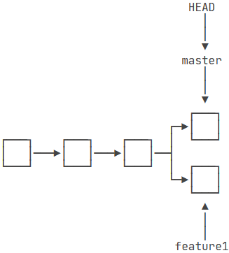

这种情况下，Git无法执行“快速合并”，只能试图把各自的修改合并起来，但这种合并就可能会有冲突:

```tex
$ git merge feature1
Auto-merging readme.txt
CONFLICT (content): Merge conflict in readme.txt
Automatic merge failed; fix conflicts and then commit the result.

C:\Users\tang\Desktop\git_learn (master)
$ git status
On branch master
You have unmerged paths.
  (fix conflicts and run "git commit")
  (use "git merge --abort" to abort the merge)

Unmerged paths:
  (use "git add <file>..." to mark resolution)
        both modified:   readme.txt

no changes added to commit (use "git add" and/or "git commit -a")
```

这个时候`readme.txt`的文件内容发生改变：

```tex
Git is a distributed version control system.
Git is free software distributed under the GPL.
Git has a mutable index called stage.
Git tracks changes.
<<<<<<< HEAD
Creating a new branch is quick & simple.
=======
Creating a new branch is quick AND simple.
>>>>>>> feature1
```

Git用`<<<<<<<`，`=======`，`>>>>>>>`标记出不同分支的内容，我们修改如下后保存：

`Creating a new branch is quick and simple.`，提交：

```tex
$ git add readme.txt

C:\Users\tang\Desktop\git_learn (master)
$ git commit -m "conflict fixed"
[master dc77d68] conflict fixed

// 查看日志  --abbrev-commit 表示显示提交的缩写哈希值（默认是7个字符）
C:\Users\tang\Desktop\git_learn (master)
$ git log --graph --pretty=oneline --abbrev-commit
*   dc77d68 (HEAD -> master) conflict fixed
|\
| * c4df771 (feature1) AND simple
* | b64d888 & simple
|/
* f8bf8e1 add git_learn files
* c359151 branch-test
* 777311f git tracks changes
* a0c1f02 understand how stage works
* 952ab47 append GPL
* 5d75afb add distributed
* 18cb185 wrote a readme file
```

现在，`master`分支和`feature1`分支变成了下图所示：

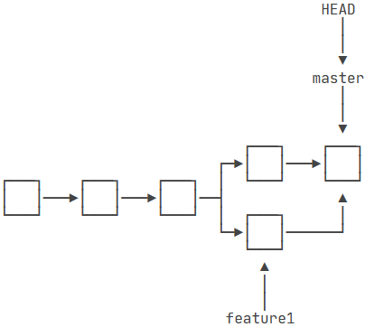

最后，删除`feature1`分支：

```tex
$ git branch -d feature1
Deleted branch feature1 (was c4df771).
```

